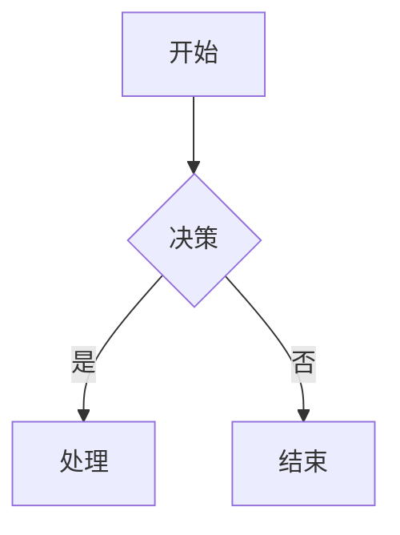

# opencode-mermaid-renderer

Render mermaid diagrams in OpenCode — generates a local HTML file that opens in your browser for rich SVG viewing (theme toggle, SVG download). Fully offline.

## Usage

Add the plugin to your OpenCode config (`%APPDATA%\opencode\config.json` on Windows, `~/.config/opencode/config.json` on Linux/macOS):

```jsonc
{
  "plugins": ["opencode-mermaid-renderer"]
}
```

Or install from local path for testing:

```jsonc
{
  "plugins": ["D:/CodeSpace/AICoding/opencode-mermaid-renderer"]
}
```

## Example

When the AI generates a mermaid diagram:

````markdown

````

The plugin outputs the original code block plus a clickable link:

```
📊 在浏览器中查看此图
```

Click the link → opens in your default browser → fully rendered SVG with:
- 🌓 Light/dark theme toggle
- 📥 One-click SVG download
- Zero network requests (fully offline after plugin install)

## Supported Diagram Types

- **Flowcharts** — `graph TD`, `graph LR`, `graph BT`, `graph RL`, `flowchart`
- **State diagrams** — `stateDiagram-v2`
- **Sequence diagrams** — `sequenceDiagram`
- **Class diagrams** — `classDiagram`
- **ER diagrams** — `erDiagram`

## How It Works

1. Plugin detects ```` ```mermaid ```` code blocks in AI responses
2. Generates a self-contained HTML file under `~/.opencode-mermaid-html/`
3. Auto-discovers bundled mermaid.js (no manual setup needed)
4. Outputs a `file://` link — click to open in browser

## Error Handling

If a diagram fails to render, the plugin keeps the original code block and adds an HTML comment with the error:

```markdown
```mermaid
invalid syntax here
```
<!-- mermaid render failed: Parse error... -->
```

## Requirements

- OpenCode >= 1.0.137
- Node.js >= 18 (or Bun)

## License

MIT
